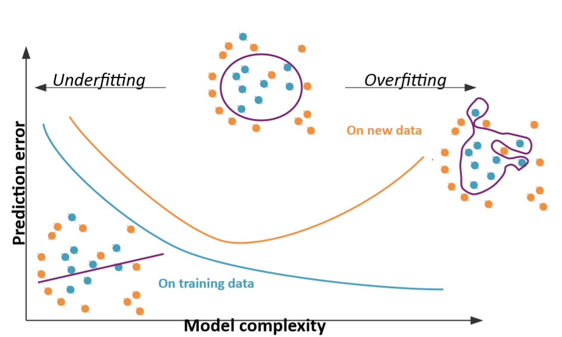
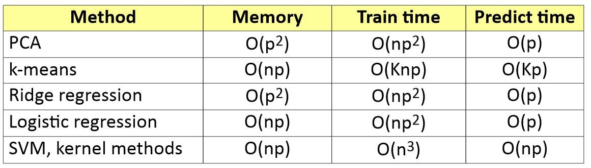
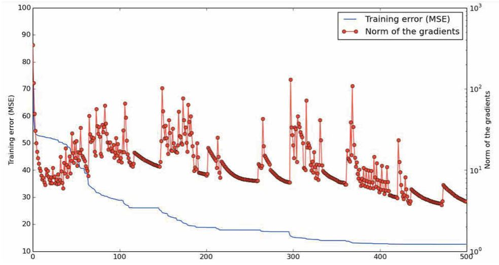
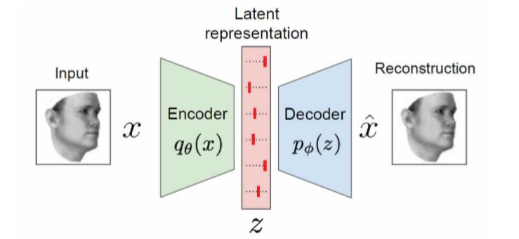

# Notes

Chloé-Agathe Azencott, Centre for Computational Biology

## 1. Introduction to Large Scale Machine Learning

### 1.1 Introduction

- risk minimization
    - ingredients: data, hypothesis class (shape of the decision function `f`), loss function
    - recipe: find among all functions of the hypothesis class, one that minimizes the loss on the training data
- (un)supervised learning
    - data matrix
    - supervision
        - binary classification
        - multi-class classification
        - regression
- large scale
    - does not fit in RAM
    - data streams
    - considerations:
        - performance increases with nb of samples
        - likely to overfit
- ML problems
    - unsupervised learning (new way to see data)
        - dimensionality reduction (find a lower-dimensional representation)
            - (PCA)[https://towardsdatascience.com/principal-component-analysis-for-dimensionality-reduction-115a3d157bad]
        - clustering
            - K-means
        - density estimation
        - feature learning
    - supervised learning (make predictions)
        - build a predictor `f(x)~y`
        - classification (discrete predictions)
            - logistic regression
            - SVM
        - regression (continuous predictions)
            - linear regression: [ordinary least squares](https://statisticsbyjim.com/regression/ols-linear-regression-assumptions/)
            - [ridge regression](https://towardsdatascience.com/ridge-regression-for-better-usage-2f19b3a202db)
            - [bias and variance](https://www.youtube.com/watch?v=EuBBz3bI-aA)
    - semi-supervised learning
    - reinforcement learning

### 1.2. Dimensionality reduction: PCA

- Principal Compenents Analysis
- The k-th principal component:
    – is orthogonal to all previous components;
    – captures the largest amount of variance;
    – solution: w is the k-th eigenvector of X^TX

### 1.3. Clustering: K-means

- find a cluster assignement that minimizes the intra-cluster variance (sum on each centroid of the distances of each point to its centroid)
    - [Voronoi tesselation](https://fr.wikipedia.org/wiki/Diagramme_de_Vorono%C3%AF)
    - NP-hard, iterative (fix centroids, update assignments, update centroids)

### 1.4. Ridge regression

- Least Squares (OLS) fit: only exists when X^TX invertible
- ridge regularization, solution unique and always exists
    - parameter lambda tells bias and variance
        - `lambda ~ 0`: OLS, low bias, high variance
        - `lambda ~ +inf`: `weights ~ 0` high bias, low variance



- hyperparameter setting: `lambda`
    - cross-validation, choose `lambda` with best cross-validation score
- l2-regularization learning
    - generalization of ridge regression to any loss

### 1.5. Gradient descent

- if the loss is convex, then the problem is **strictly convex** and has a **unique global solution** which can be found numerically

### 1.6. Classification (to do)

### 1.7. Kernel methods

- non-linear mapping to a feature space
- efficient to compute




## 2. Deep-Learning

### 2.1. CNN
- intro
    - incredible results in image and speech recognition
    - deep learning : huge models, millions of parameters, 100 layers
    - ImageNet, huge dataset (1 million examples)
    - in deep learning, the model **learns the features**
- origins
    - Yann LeCun (French pro. at the NYU, AI director of Facebook)
    - supervised learning
- Multi-Layer Perceptron directly on images is not a good idea
- components
    - convolutions
    - pooling (aggregation over space, noise reduction)
        - average pooling
        - max pooling
    - final classification layer : just a regular MLP (`dense`)
- training
    - total gradient: `W(t+1) = W(t) - l(t) gradW(Q(t))  + m(t)[W(t)-W(t-1)]`
    - in high dim, saddle points dominate and therefore local minima are close to the global minimum
        - approaching saddle points and then escaping them
        
    - tricks
        - input normalization (zero mean, unit variance)
        - weights initialization random but SMALL and prop. to `1/sqrt(nbInputs)`
        - decreasing (or adaptive) learning rate
        - large number of free parameters -> train with a sufficiently large training-set
        - avoid overfitting by:
            - Use of L1 or L2 regularization (after some epochs)
            - Use "Dropout" regularization
    - regularization to avoid overfitting

### 2.2. Useful pre-trained convNets
- LeNet: digits/letters recognition
- AlexNet, image categorization
    - ZFnet
- GoogleNet (inception module, several paths then merged)
- ResNet (residual, skip connections, map with identity)
    - 2-3 weeks of training on 8 GPU machine !!
- PoseNet (precise localization, position + bearing)
- OpenPose (human posture estimation)

### 2.3. Coding frameworks
- [TensorFlow](https://www.tensorflow.org)
- [Caffe](http://caffe.berkeleyvision.org/), C++ library, hooks
from Python notebooks
- [Theano](http://www.deeplearning.net/software/theano/)
    - [Lasagne](http://lasagne.readthedocs.io), lightweight library to build + train neural nets in Theano
- [pyTorch](https://pytorch.org/)
- [Keras](https://keras.io), Python front-end APIs mapped either on Tensor-Flow or Theano back-end

### 2.4. Transfer Learning
- by removing last layers of a convNet trained on ImageNet we obtain a transformation of any input image into a semi-abstract representation
- we can freeze the layers or fine-tune them
- applications:
    - learning on simulated synthetic images + fine-tuning on real-world images 
    - recognition/classification for other categories or classes
```py
from keras.applications.inception_v3 import InceptionV3
from keras.preprocessing import image
from keras.models import Model
from keras.layers import Dense, GlobalAveragePooling2D
from keras import backend as K # create the base pre-trained model
base_model = InceptionV3(weights='imagenet', include_top=False) # add a global spatial average pooling layer
x = base_model.output
x = GlobalAveragePooling2D()(x)
# let's add a fully-connected layer
x = Dense(1024, activation='relu')(x)
# and a logistic layer -- let's say we have 200 classes
predictions = Dense(200, activation='softmax')(x)
model = Model(input=base_model.input, output=predictions)
# first: train only the top layers (which were randomly initialized)
# i.e. freeze all convolutional InceptionV3 layers
for layer in base_model.layers:
    layer.trainable = False
# compile the model (should be done *after* setting layers to non-trainable)
model.compile(optimizer='rmsprop', loss='categorical_crossentropy')
# train the model on the new data for a few epochs
model.fit_generator(...)
```

### 2.5. Object localization and Semantic segmentation
- [Faster_RCNN](https://arxiv.org/pdf/1506.01497.pdf): object detection and categorization
    - Region Proposal Network (RPN) on top of convNet
    - end-to-end training with 4 losses
- single shot detection: YOLO, SSD, faster but less accurate than Faster_RCNN
- Mask_RCNN: categorization, localization with shape/contours
- semantic segmentation
    - encoder-decoder
    - SegNet (2015)
    - U-Net (2015)
    - RefineNet (2016)
    - ICnet (2017)
    - DeepLab 

### 2.6. Deep-Learning on 1D signal and 3D data
- time-series: MC-DCNN model
    - separate 1D temporal convolution of each time series
    - deep gesture recognition
- 3D data
    - possible to use 2D images of multiple views, 2D depth images
    - 3D convolutions on voxels: [VoxNet](https://www.ri.cmu.edu/pub_files/2015/9/voxnet_maturana_scherer_iros15.pdf), [GitHub](https://github.com/Durant35/VoxNet)    

### 2.7. Conclusion
- Enormous potential of transfer-learning on small datasets for restricted/specialized problems
- perspectives:
    - UNsupervised deep-learning on unlabelled data
    - Deep Reinforcement Learning (DRL)
    - Deep Recurrent Neural Networks
    
    
## 3. Deep-Learning - Unsupervised Generative models

### 3.1. Unsupervised Learning and Generative Models
||Supervised learning|Unsupervised learning|
|:-:|:-:|:-:|
|data|`(x,y)`, data and label|`x`, only data|
|goal|how to map `x->y`|learn hidden structure of data|

- [generative models](https://towardsdatascience.com/deep-generative-models-25ab2821afd3)

### 3.2. Deep Belief Networks (DBN) and Deep Boltzman Machine (DBM)
- for capturing high-order correlations of observed/visible data
    - successive unsupervised learning of layers of Restricted Boltzmann Machine (RBM)
- RBM
- using low-dim final features for clustering

### 3.3. Autoencoders


- learn `q_0` and `p_0` in order to minimize __reconstruction cost__
- variants :
    - denoising autoencoders
    - sparse autoencoders
    - stochastic autoencoders
    - contractive autoencoders
    - variational autoencoders 

### 3.4. Generative Adversarial Networks (GAN)
- goal: generate artificial credible examples
    - **generator network**: try to fool the discriminator by generating real-looking images
    - **discriminator network**: try to distinguish between real and fake images
    - formulate as `min_G min_D V(D,G)`
- application:
    - trajectory in latent space
    - image-to-image translation
    - domain transfer
